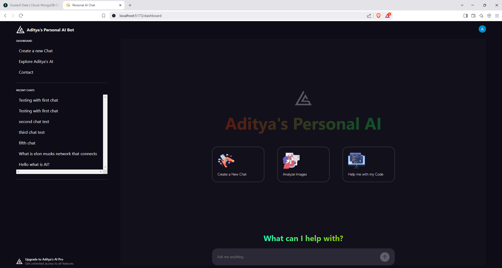

# AI ChatBot 

FullStack Personal AI Chatbot to reduce query limitations. Front end runs with React JS and Backend Runs with Node JS. I wanted full control over my data, no rate limits, and access to premium features without the paywall. Using React, Node.js, Express, MongoDB, and Clerk for authentication, I built this project as a deep dive into full-stack development, authentication, and real-time chat functionality.

## PROJECT IMAGES

### **HOMEPAGE**


### **DASHBOARD**


### **TAILORED FOR USER PROFILE**


### **DATABSE OF USER CHATS ACCORING TO USER ID**


### **ALL CHATS**


### **GIF**


## DEPENDENCIES FOR FRONTEND
```bash
npm install -f react-router-dom
npm install -f @clerk/clerk-react
npm install -f react-type-animation
npm install -f imagekitio-react
npm install -f @google/generative-ai
npm install -f react-markdown
npm install -f mongodb
npm install -f @tanstack/react-query
```

## Create an account with clerk
- <a href="https://clerk.com/"> **Create an application an integrate with google, email, GitHub.** </a>
- Get your publishable key and store it in a file .env.

## Register with ImageKit.io
- <a href="https://imagekit.io/"> **Create an account with Image kit that is useful for rendering images**.
- Go to developer settings and get the URL endpoint, public key and add it to .env file. The following has to  be added
```list
VITE_IMAGE_KIT_ENDPOINT="URL"
VITE_IMAGE_PUBLIC_KEY=key
```
- The private key is for backend.
- The backend will use this private key when we upload images. 

## Create Backend that runs with Node JS
- Create a working directory for backend
- Run the command "npm init -y"

## DEPENDENCIES FOR BACKEND
```bash
npm install nodemon #For the session to be up without being closed.
npm install express
npm install imagekit
npm install cors
npm install @google/generative-ai
npm install mongodb
npm install @clerk/clerk-sdk-node
```


